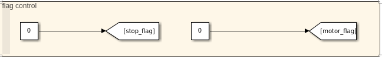
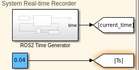
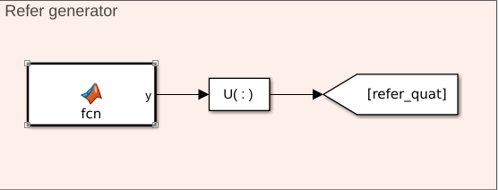
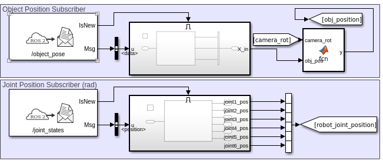
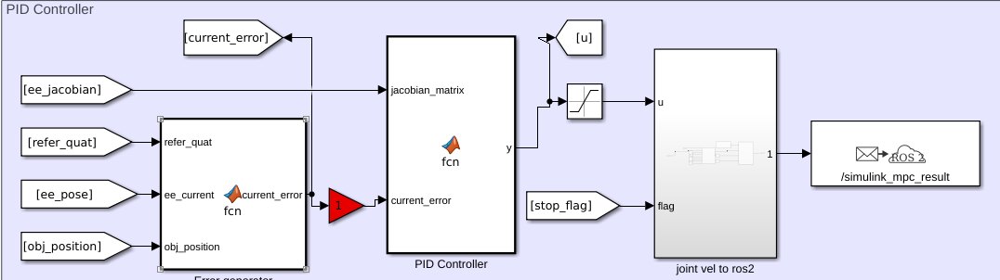
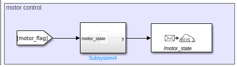
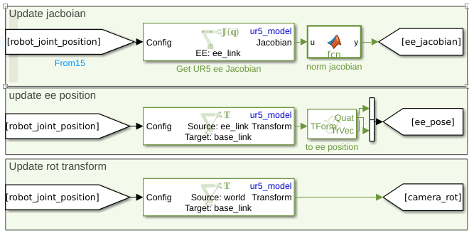
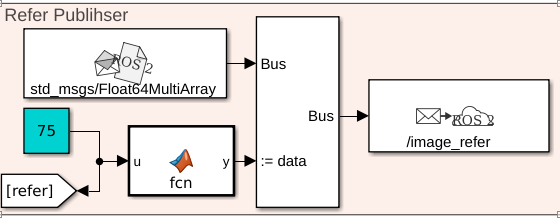
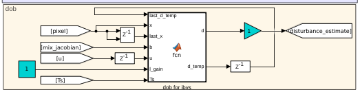
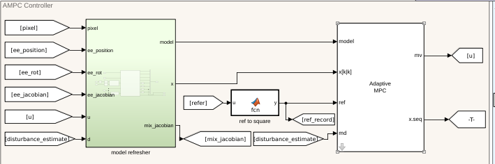

### 位置/图像视觉伺服

运行前保证当前工作空间已经被source

1、启动机械臂
```shell
ros2 launch ur_robot_driver ur_control.launch.py ur_type:=ur5 robot_ip:=192.168.1.102
```
2、在UR示教器里启动对应的程序

3、切换机械臂控制器到关节速度控制下
```shell
ros2 control switch_controllers --deactivate scaled_joint_trajectory_controller --activate forward_velocity_controller
```
4、启动视觉检测节点
⭐⭐⭐在保证相机硬件和传输线正常的情况下，如果运行失败没出现图像，关闭本节点重新启动一般即可。
```shell
ros2 run object_detector object_detector
```

5、启动伺服节点
```shell
ros2 run ur5_servo joint_vel_sender
```

6、启动传送带控制节点
```shell
ros2 run conveyor_belt_control belt_control
```
7、如果未从终端启动matlab，记得在matlab命令行里输入
```matlab
setenv("ROS_DOMAIN_ID","15")
```
8、启动对应的matlab程序

###位置视觉伺服simulink部分

目前仅实现了位置(xyz)跟踪，程序位于ias_lab_visual_servo/simulink/ur5_simulink_ros2_pbvs_mpc/ur5_simulink_ros2_pbvs_pid.slx下

⭐⭐⭐运行simulink前先执行ur5_model_init.m，初始化机械臂模型。

1、flag_control: stop_flag用于控制机械臂是否运行，其中1为停止，其他数为运行;motor_flag为电机控制0为停止，1到4为绝对位置正向运动，-1到-4为到绝对位置的反向移动，数字绝对值越大速度越快。
<p align="center">

</p>
2、time record: 用于记录当前程序运行时间，主要用作画图，或者自己设计不同时间的参考输入或电机运转。
<p align="center">

</p>
3、refer quat: 目前没有做位置反馈，所以自己设置了一个参考姿态。
<p align="center">

</p>
4、subscriber: 从ros2订阅跟踪物体空间位置和实时获取机械臂各个关节角度。

⭐ 注意ros2订阅回来的机械臂关节顺序和实际的不太一样，对应simulink已经进行修改。

<p align="center">

</p>

5、controller: 比例控制器设计例子

<p align="center">

</p>

6、controller: 比例控制器设计例子，并发布关节速度到ros2中。

<p align="center">

</p>

7、motor: 发布对应的电机控制信号到ros2中。

<p align="center">

</p>

8、trans: 机械臂坐标变化和雅克比矩阵获取。
<p align="center">

</p>

9、data: 运行过程信息记录，用于在matlab端画图。
<p align="center">

</p>


###图像视觉伺服simulink部分

主程序位于ias_lab_visual_servo/simulink/ur5_simulink_ros2_ibvs_mpc/ur5_simulink_ros2_ibvs_mpc.slx下

⭐⭐⭐运行simulink前先执行all_init.m，初始化机械臂模型。

1、refer: 期望图像像素点的位置，蓝色数字越大，期望像素点所组成的正方型位于图像中心的面积就越大。
<p align="center">

</p>
2、dob: 用于估计外界对像素点的扰动。
<p align="center">

</p>
3、controller: 控制器相比之前的做了较大的改进，以关节速度实现控制，考虑了末端限位与地面碰撞问题，目前可实现大旋转角度下的定位，但是输出的是关节速度，不再是笛卡尔空间控制，其他大部分组件与pbvs类似，故不做过多解释。
<p align="center">

</p>